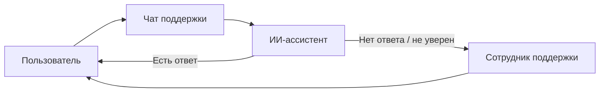

# AI Support Chat / Technical Support Assistant

<p align="center">
  
  

  
</p>

Проект представляет собой демонстрационное веб-приложение для технической поддержки, в котором пользователь может задать вопрос в чате, а искусственный интеллект помогает ответить на него. Если модель не может дать корректный ответ, вопрос автоматически переводится в чат сотрудника поддержки, где специалист продолжает диалог вручную.

> Все данные в проекте являются выдуманными и используются только в демонстрационных целях.

## Что делает проект

- Пользователь задаёт вопрос через чат поддержки
- ИИ отвечает на запрос в реальном времени на основе данных из БД
- Если ответ не найден или модель не уверена, чат передаётся сотруднику поддержки
- Сотрудник видит список открытых обращений и может отвечать внутри панели оператора
- Обновления сообщений происходят в реальном времени через Laravel Reverb
- Поддерживается работа с историей сообщений и статусом прочтения

## Как это работает



## Основные возможности

- Чат пользователя с поддержкой
- Панель оператора/сотрудника
- Поддержка статусов чата: открытый, обработанный, назначенный
- Автоматическое определение темы вопроса
- Интеграция с AI-сервисами для ответов
- Реальное время через WebSockets и событийную модель Laravel
- Простая и понятная структура на Laravel

## Технологический стек

| Категория | Технология |
| --- | --- |
| Backend | PHP 8.3, Laravel 13 |
| Real-time | Laravel Reverb, Laravel Echo, WebSockets |
| Frontend | Blade, JavaScript, Vite |
| AI | OpenAI API, OpenRouter, Ollama |
| Styling | Bootstrap, custom CSS |
| Database | MySQL / SQLite-compatible Laravel DB |
| Package management | Composer, npm |
| Testing | PHPUnit |

### Важная особенность

В проекте используется Laravel Reverb для организации обмена событиями и обновлений чата в реальном времени. Это позволяет мгновенно показывать новые сообщения, статусы печати и уведомления сотрудникам поддержки без перезагрузки страницы.

## Структура проекта

```text
app/
  Http/Controllers/      - контроллеры для чата и панели поддержки
  Events/                - события для realtime-обновлений
  Models/                - модели чатов, сообщений и пользователей
  Services/              - интеграции с AI и логика обработки запросов
config/                 - настройки Laravel, Reverb и приложений
resources/views/        - Blade-шаблоны интерфейса
routes/                 - маршруты приложения
public/                 - статические файлы и точка входа
database/               - миграции и seed-данные
```

## Установка и запуск

### 1. Клонирование

```bash
git clone https://github.com/web-intelligent/chatbot.git
cd ai-support-chat
```

### 2. Установка зависимостей

```bash
composer install
npm install
```

### 3. Настройка окружения

Создайте файл `.env` на основе `.env.example` и настройте ключи приложения:

```bash
cp .env.example .env
php artisan key:generate
```

Далее укажите параметры для:

- базы данных
- открытого AI API (`OpenAI` / `OpenRouter` / `Ollama`)
- Laravel Reverb

### 4. Миграции

```bash
php artisan migrate
```

### 5. Запуск проекта

```bash
php artisan serve
php artisan reverb:start
npm run dev
```

Или используйте подготовленный командный сценарий:

```bash
composer run dev
```

## Пример пользовательского сценария

1. Пользователь открывает чат поддержки.
2. Он пишет вопрос: "Когда пройдёт следующий семинар по судейству?"
3. AI анализирует запрос и пытается дать ответ. Ответ будет основан на основе данных из календаря мероприятий.
4. Если модель не знает точного ответа, система отправляет вопрос сотруднику поддержки.
5. Оператор видит обращение в панели управления и продолжает диалог.

## Используемые принципы

- Интерактивный пользовательский опыт
- Комбинация AI и человеческой поддержки
- Быстрая коммуникация в режиме реального времени
- Готовая основа для расширения функциональности

## Лицензия

Проект распространяется под лицензией MIT.

## Автор

Проект демонстрирует мои навыки в разработке на Laravel, архитектуре веб-приложений, интеграции AI, работе с WebSockets и построении пользовательских интерфейсов. Проект довольно сырой и многое ещё предстоит доработать.

